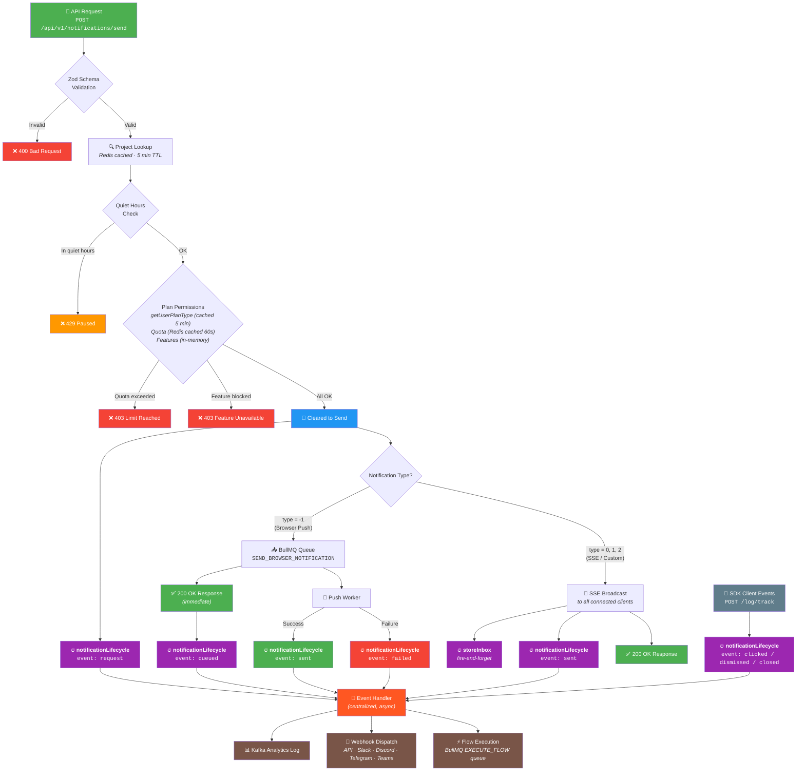

# Notification Send Flow

## Event-Driven Architecture

Every notification lifecycle event flows through a **single centralized handler** (`notificationLifecycle`) that automatically triggers:
1. **Kafka analytics logging** — activity tracking
2. **Webhook dispatch** — to all matching user webhooks (API, Slack, Discord, Telegram, Teams)
3. **Flow execution** — triggers matching active automation flows

Nothing blocks the main thread. Everything is fire-and-forget via `AppEvents.emit()`.

## Legend

| Color | Meaning |
|-------|---------|
| 🟢 Green | Success responses |
| 🔴 Red | Error / failure |
| 🟠 Orange | Rate-limited |
| 🟣 Purple | Async fire-and-forget events (never block main thread) |
| 🔵 Blue | Cleared checkpoint |
| ⚫ Gray | External SDK client |

## Key Architecture Points

- Every **purple** box is **non-blocking** — runs via `AppEvents.emit()` off the main thread
- The `notificationLifecycle` event handles **both** Kafka analytics logging and webhook dispatch in one shot
- For push notifications: response returns **immediately** after queueing, actual delivery is async via BullMQ worker
- All DB lookups on the hot path are **Redis-cached**:
  - Project lookup: 5 min TTL
  - Plan type: 5 min TTL
  - Quota count: 60s TTL
  - Feature flags: in-memory (zero I/O)

## Notification Lifecycle Events

| Event | When |
|-------|------|
| `request` | API receives a send request |
| `queued` | Push notification enters BullMQ queue |
| `sent` | Dispatched to browser (push) or SSE clients |
| `delivered` | Confirmed delivered by browser |
| `clicked` | User clicked the notification |
| `dismissed` | User explicitly dismissed (X / swipe) |
| `closed` | Auto-closed (timeout / replaced) |
| `dropped` | Dropped (quiet hours, quota, invalid sub) |
| `failed` | Send failed (webpush error, network) |

## Webhook Events

| Event | Trigger |
|-------|---------|
| `notification.sent` | Notification dispatched |
| `notification.failed` | Push delivery failed |
| `notification.dropped` | Notification dropped |
| `notification.clicked` | User clicked |
| `notification.closed` | Notification closed |
| `notification.queued` | Push queued |
| `notification.delivered` | Push delivered |
| `notification.dismissed` | User dismissed |
| `user.subscribed` | New push subscription |
| `user.unsubscribed` | Push unsubscribe |
| `project.created` | New project |
| `domain.verified` | Domain verified |
